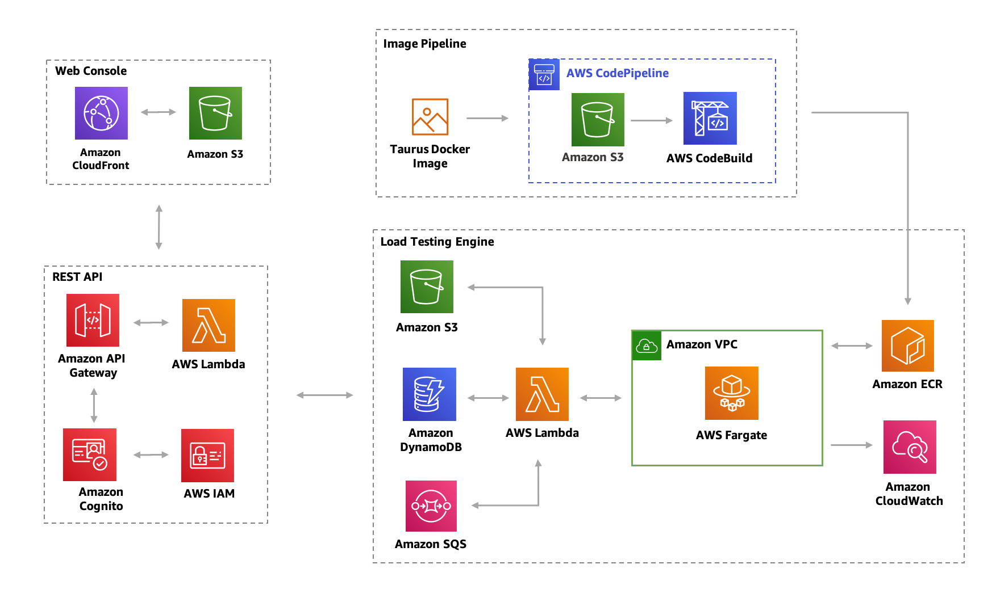

# Distributed Load Testing on AWS

The Distributed Load Testing Solution leverages managed, highly available and highly scalable AWS services to effortlessly create and simulate thousands of connected users generating a selected amount of transactions per second. As a result, developers can understand the behavior of their applications at scale and at load to identify any bottleneck problems before they deploy to Production.


## On this Page
- [Architecture Overview](#architecture-overview)
- [Deployment](#deployment)
- [Source Code](#source-code)
- [Creating a custom build](#additional-resources)


## Architecture Overview


## Deployment
The solution is deployed using a CloudFormation template with a lambda backed custom resource. For details on deploying the solution please see the details on the solution home page: [Distributed Load Testing](https://aws.amazon.com/solutions/distributed-load-testing-on-aws/)

## Source Code

**source/api-services**<br/>
A NodeJS Lambda function for the API microservices. Integrated with Amazon API Gateway, used to manage test scenarios.

**source/console**<br/>
ReactJS Single page application to provide a GUI to the solutions. Authenticated through Amazon Cognito this dashboard allows users to Create tests and view the final results.

**source/container**<br/>
The Taurus DockerFile and bash script run at start of the test to download the test definition from S3. This is the source file for the image pipeline to build and deploy the Docker image to Amazon ECR. Details on Taurus can be found [here](https://gettaurus.org/).

**source/custom-resource**<br/>
A NodeJS Lambda function used as a CloudFormation custom resource for configuring Amazon S3 bucket notifications and to send anonymous metrics.

**source/results-parser**<br/>
A NodeJS Lambda function used to write the xml output from the docker images  to Amazon DynamoDB and generate the final results for each test.

**source/task-runner**<br/>
A NodeJS Lambda function that Runs The Amaazon ECS task definition for each test.


## Creating a custom build
The solution can be deployed through the CloudFormation template available on the solution home page: [Distributed Load Testing](https://aws.amazon.com/).
To make changes to the solution, download or clone this repo, update the source code and then run the deployment/build-s3-dist.sh script to deploy the updated Lambda code to an Amazon S3 bucket in your account.

### Prerequisites:
* [AWS Command Line Interface](https://aws.amazon.com/cli/)
* Node.js 10.x or later

### 1. Running unit tests for customization
Run unit tests to make sure added customization passes the tests:
```
cd ./deployment
chmod +x ./run-unit-tests.sh
./run-unit-tests.sh
```

### 2. Create an Amazon S3 Bucket
The CloudFormation template is configured to pull the Lambda deployment packages from Amazon S3 bucket in the region the template is being launched in. Create a bucket in the desired region with the region name appended to the name of the bucket. eg: for us-east-1 create a bucket named: ```my-bucket-us-east-1```
```
aws s3 mb s3://my-bucket-us-east-1
```

### 3. Create the deployment packages
Build the distributable:
```
chmod +x ./build-s3-dist.sh
./build-s3-dist.sh my-bucket video-on-demand-on-aws %%VERSION%%-custom
```

> **Notes**: The _build-s3-dist_ script expects the bucket name as one of its parameters, and this value should not include the region suffix. In addition to that, the version parameter will be used to tag the npm packages, and therefore should be in the [Semantic Versioning format](https://semver.org/spec/v2.0.0.html).

Deploy the distributable to the Amazon S3 bucket in your account:
```
aws s3 cp ./regional-s3-assets/ s3://my-bucket-us-east-1/video-on-demand-on-aws/%%VERSION%%-custom/ --recursive --acl bucket-owner-full-control
```

### 4. Launch the CloudFormation template.
* Get the link of the video-on-demand-on-aws.template uploaded to your Amazon S3 bucket.
* Deploy the Video on Demand to your account by launching a new AWS CloudFormation stack using the link of the video-on-demand-on-aws.template.

***

Copyright 2019 Amazon.com, Inc. or its affiliates. All Rights Reserved.

Licensed under the Apache License, Version 2.0 (the "License");
you may not use this file except in compliance with the License.
You may obtain a copy of the License at

    http://www.apache.org/licenses/LICENSE-2.0

Unless required by applicable law or agreed to in writing, software
distributed under the License is distributed on an "AS IS" BASIS,
WITHOUT WARRANTIES OR CONDITIONS OF ANY KIND, either express or implied.
See the License for the specific language governing permissions and
limitations under the License.